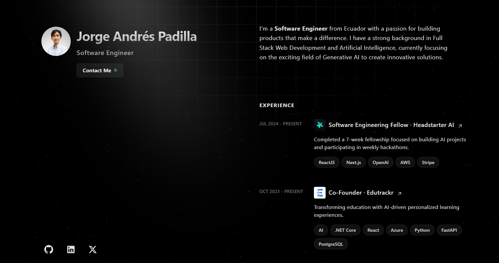

<div align="center">
  
  <h2 align="center">Personal Website</h1>
</div>

## 🚀 Quick start

1.  **Clone the repository.**
    ```shell
    git clone https://www.github.com/jorgeandrespadilla/personal-website.git
    ```
2. **Install dependencies.**
    ```shell
    npm install
    ```
3.  **Start developing.**
    ```shell
    npm run dev
    ```
4.  **Open the source code and start editing!**

    The site is now running at `http://localhost:4321`!
